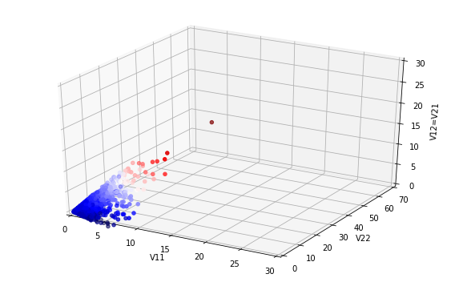
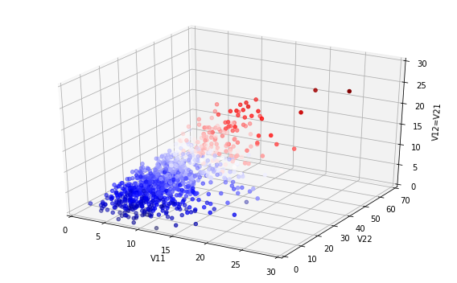

.. title: Visualising the Wishart Distribution
.. slug: visualising-the-wishart-distribution
.. date: 2017-12-08 12:08:22 UTC
.. tags: 
.. category: 
.. link: 
.. description: 
.. type: text
.. has_math: true

.. role:: raw-html(raw)
   :format: html

This semester, I have been teaching Multivariate Statistics, and one isse that comes up is how to think
about the Wishart distribution, which generalises the :raw-html:`\(\chi^2 \)` distribution. This has
probability density function

:raw-html:`$$ f_{\chi^2_k}(x) = \frac{1}{2\,\Gamma\!\left(\frac{k}{2}\right)} \left(\frac{x}{2}\right)^{\frac{k}{2}-1} {\rm e}^{-\frac{x}{2}} . $$`

To visualise this at different degrees of freedom :raw-html:`\(k \)`, we use the following Python code.

.. code:: ipython3

    %matplotlib inline
    import numpy as np
    import scipy.stats as st
    import matplotlib.pyplot as plt
    from mpl_toolkits.mplot3d import Axes3D

.. code:: ipython3

    np.random.seed(42)
    Sig1 = np.array([[1,0.75],[0.75,2]])
    n=1000

.. code:: ipython3

    x = np.linspace(0, 10, 1000)
    plt.figure(figsize=(8,4))
    colors = plt.cm.Accent(np.linspace(0,1,4))
    i=0
    for k in (1,2,5,10):
        c = st.chi2.pdf(x, k);
        plt.plot(x,c, label='k = ' + str(k), color=colors[i],linewidth=3)
        i += 1
    plt.xlim((0,10))
    plt.ylim((0,0.5))
    plt.xlabel('x')
    plt.ylabel('f(x)')
    plt.legend()

.. image:: ../output_2_1.png

The Wishart emerges when we make :raw-html:`\(k \)` observations each with :raw-html:`\(p \)` variables; the
sampling distribution for the covariance matrix of these data if the population is multivariate normal is
Wishart and has probability density function

:raw-html:`$$ f_{\mathcal{W}_p(k,\boldsymbol{\Sigma})}(\boldsymbol{V}) = \frac{\mathrm{det}(\boldsymbol{V})^{\frac{k - p - 1}{2}}}{2^{ \frac{k p}{2} } \mathrm{det}(\boldsymbol{\Sigma})^\frac{k}{2} \Gamma_p\!\left(\frac{k}{2} \right)} \exp\left( -\frac12 \mathrm{Tr}(\boldsymbol{\Sigma}^{-1} \boldsymbol{V}) \right) . $$`

In general, this cannot be visualised, but for the :raw-html:`\(p=2 \)` case, one option is to pick random
numbers from this distribution and then produce a three-dimensional scatter plot of these. The code and results
below show that this can be seen as behaving somewhat like the chi-squared distribution that it generalises as
the degrees of freedom :raw-html:`\(k \)` are increased.

.. code:: ipython3

    x=np.zeros(n)
    y=np.zeros(n)
    z=np.zeros(n)
    for i in range(0,n):
        M=st.wishart.rvs(2,scale=Sig1,size=1)
        x[i]=M[0][0]
        y[i]=M[1][1]
        z[i]=M[1][0]
    fig = plt.figure(figsize=(8,5))
    ax = fig.add_subplot(111, projection='3d')
    ax.scatter3D(x,y,z, marker='o', c=z, cmap='seismic')
    ax.set_xlabel('V11')
    ax.set_ylabel('V22')
    ax.set_zlabel('V12=V21')
    ax.set_xlim((0,30))
    ax.set_ylim((0,70))
    ax.set_zlim((0,30))
    plt.tight_layout()

.. code:: ipython3

    x=np.zeros(n)
    y=np.zeros(n)
    z=np.zeros(n)
    for i in range(0,n):
        M=st.wishart.rvs(5,scale=Sig1,size=1)
        x[i]=M[0][0]
        y[i]=M[1][1]
        z[i]=M[1][0]
    fig = plt.figure(figsize=(8,5))
    ax = fig.add_subplot(111, projection='3d')
    ax.scatter3D(x,y,z, marker='o', c=z, cmap='seismic')
    ax.set_xlabel('V11')
    ax.set_ylabel('V22')
    ax.set_zlabel('V12=V21')
    ax.set_xlim((0,30))
    ax.set_ylim((0,70))
    ax.set_zlim((0,30))
    plt.tight_layout()

.. image:: ../output_4_0.png

.. code:: ipython3

    x=np.zeros(n)
    y=np.zeros(n)
    z=np.zeros(n)
    for i in range(0,n):
        M=st.wishart.rvs(10,scale=Sig1,size=1)
        x[i]=M[0][0]
        y[i]=M[1][1]
        z[i]=M[1][0]
    fig = plt.figure(figsize=(8,5))
    ax = fig.add_subplot(111, projection='3d')
    ax.scatter3D(x,y,z, marker='o', c=z, cmap='seismic')
    ax.set_xlabel('V11')
    ax.set_ylabel('V22')
    ax.set_zlabel('V12=V21')
    ax.set_xlim((0,30))
    ax.set_ylim((0,70))
    ax.set_zlim((0,30))
    plt.tight_layout()

